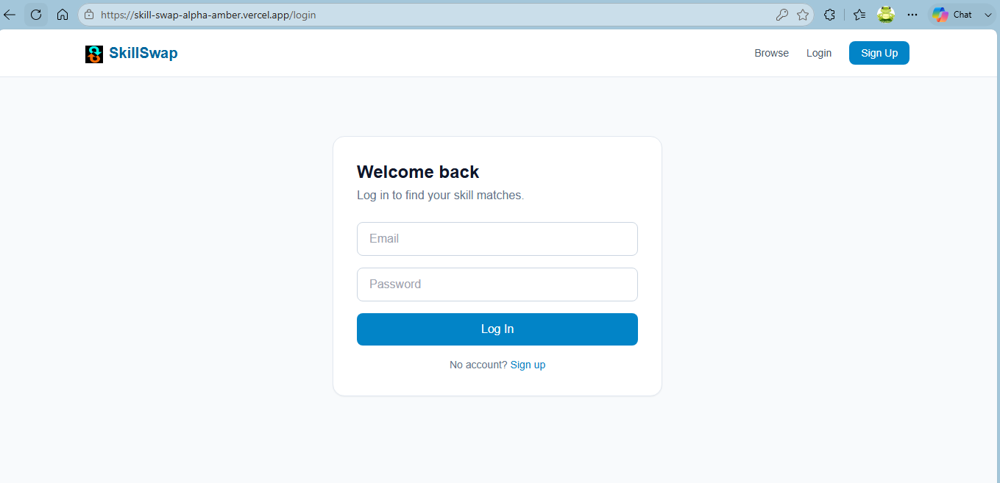
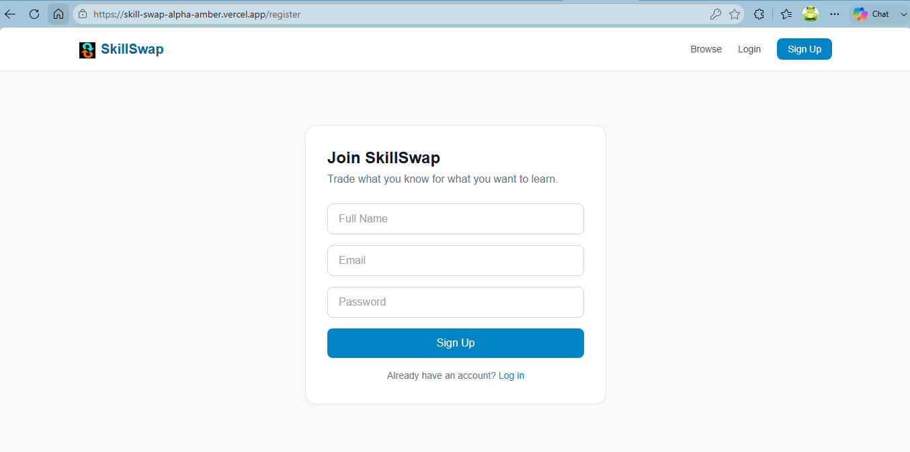
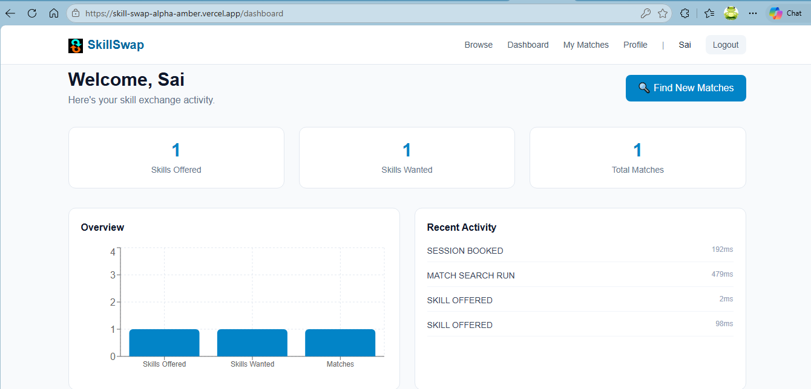
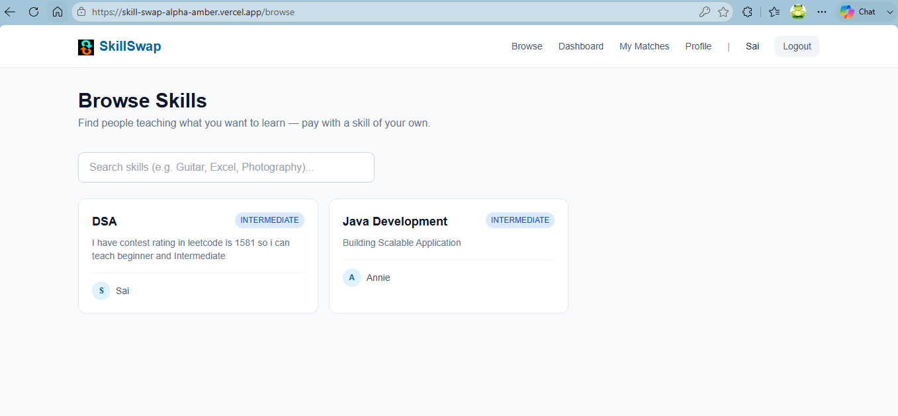
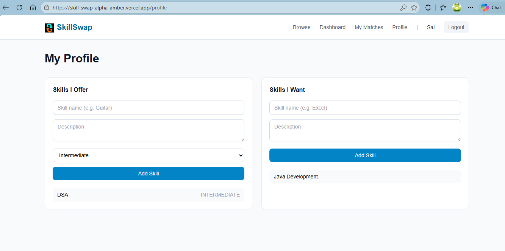
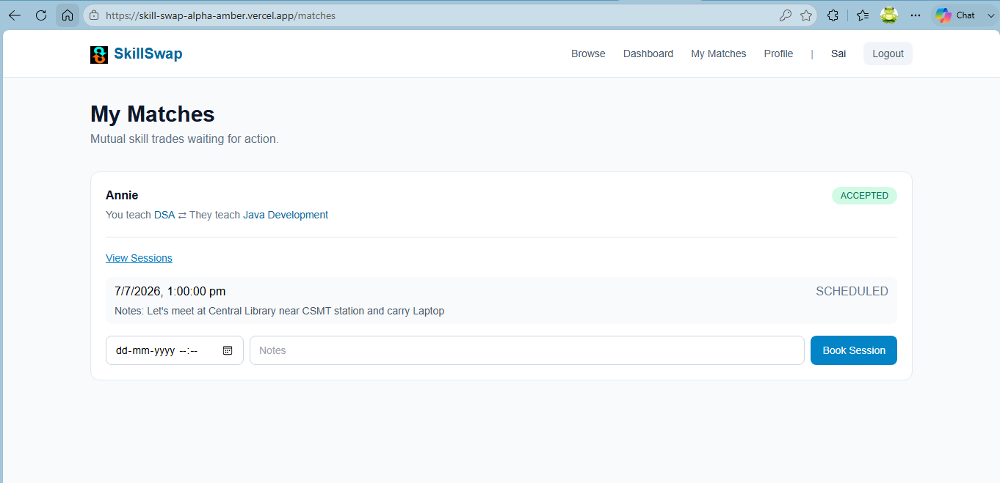
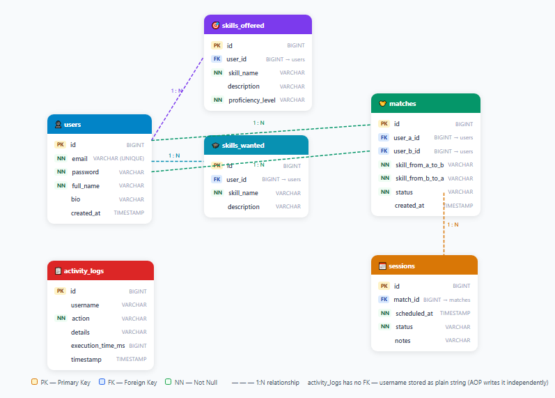

# 🔄 SkillSwap – A Skill Exchange Platform

<p align="center">


</p>

A full-stack web application where people **exchange skills instead of money**.

> _"I'll teach you Java if you teach me Photoshop."_

Unlike traditional marketplaces, SkillSwap connects users through **mutual skill matching**, allowing both participants to benefit from every interaction.

Built using **Spring Boot**, **React**, **PostgreSQL**, **Spring Security**, **JWT Authentication**, and **Spring AOP**, the application demonstrates clean architecture, secure authentication, cross-cutting concerns, and modern full-stack development practices.

---

# 🌐 Live Demo

**Frontend:** https://skill-swap-alpha-amber.vercel.app

**Backend API:** https://skillswap-hp24.onrender.com

**Database:** Neon PostgreSQL

---

# 📸 Application Preview

## Login



---

## Register



---

## Dashboard



---

## Browse Skills



---

## Profile



---

## Matches



---

## Database Schema



---

# ✨ Features

## 🔐 Authentication

- User Registration
- Secure Login
- JWT Authentication
- BCrypt Password Encryption
- Protected REST APIs
- Role-based authorization ready

---

## 👤 User Profile

Users can

- Add skills they can teach
- Add skills they want to learn
- Manage profile
- Update skill information

---

## 🔍 Browse Skills

- Search available skills
- Explore community members
- Responsive card-based interface

---

## 🤝 Mutual Skill Matching

The core feature of SkillSwap.

Instead of simply listing users with a skill, the application performs **two-way matching**.

Example

```
You Teach:
Java

You Want:
Photoshop

Another User

Teaches:
Photoshop

Wants:
Java

✅ Perfect Match
```

This creates meaningful exchanges where both users gain value.

---

## 📅 Session Management

Matched users can

- Schedule learning sessions
- Track session status
- Maintain learning history

---

## 📊 Dashboard

The dashboard provides

- Total Skills Offered
- Skills Wanted
- Current Matches
- Scheduled Sessions
- Recent Activities

---

## ⚡ Spring AOP Features

Unlike many portfolio projects, SkillSwap uses Spring AOP for real application features.

### @LogActivity

Automatically

- Records user actions
- Measures execution time
- Saves activity history
- Powers the dashboard's Recent Activity feed

without adding logging code inside business services.

---

### @RateLimited

A custom annotation that

- Prevents excessive match requests
- Uses an in-memory sliding window algorithm
- Protects expensive operations
- Keeps business logic clean

---

# 🏗 Architecture

```
                React Frontend
                       │
                 Axios REST Calls
                       │
             Spring Boot REST API
                       │
        Spring Security + JWT Filter
                       │
         Controllers → Services
                       │
              Spring AOP Aspects
          ┌────────────┴────────────┐
      Activity Logging      Rate Limiting
                       │
             Spring Data JPA
                       │
                PostgreSQL
```

---

# 🛠 Tech Stack

## Frontend

- React
- Vite
- JavaScript
- CSS
- Axios
- React Router

---

## Backend

- Java 21
- Spring Boot 3
- Spring Security
- JWT Authentication
- Spring Data JPA
- Spring AOP
- Maven
- REST APIs

---

## Database

- PostgreSQL (Neon)

---

## Deployment

| Service | Platform |
|----------|----------|
| Frontend | Vercel |
| Backend | Render |
| Database | Neon PostgreSQL |

---

# 📁 Project Structure

```
skillswap/

│

├── backend/

│   ├── controller/

│   ├── service/

│   ├── repository/

│   ├── entity/

│   ├── dto/

│   ├── security/

│   ├── config/

│   ├── aop/

│   └── exception/

│

├── frontend/

│   ├── api/

│   ├── components/

│   ├── context/

│   ├── pages/

│   ├── assets/

│   └── styles/

│

└── README.md
```

---

# 🔐 Authentication Flow

```
User

↓

Register/Login

↓

JWT Generated

↓

Token Stored

↓

Protected Requests

↓

JWT Filter

↓

Spring Security

↓

Authorized APIs
```

---

# 📡 REST API Overview

| Method | Endpoint | Description |
|----------|-------------------------|-----------------------------|
| POST | /api/auth/register | Register user |
| POST | /api/auth/login | Login |
| GET | /api/skills/browse | Browse skills |
| POST | /api/skills/offer | Add offered skill |
| POST | /api/skills/want | Add wanted skill |
| GET | /api/skills/mine | My skills |
| POST | /api/matches/search | Find matches |
| GET | /api/matches | My matches |
| PUT | /api/matches/{id}/status | Update match |
| GET | /api/activity/recent | Activity history |

---

# 🗄 Database

The application uses a normalized PostgreSQL database consisting of

- Users
- Skills Offered
- Skills Wanted
- Matches
- Sessions
- Activity Logs

The schema ensures proper relationships between users, skills, matches, and learning sessions.

---

# 🚀 Running Locally

## Clone Repository

```bash
git clone https://github.com/latkesai-dev/skillswap.git
```

Backend

```bash
cd backend

mvn spring-boot:run
```

Frontend

```bash
cd frontend

npm install

npm run dev
```

---

# ⚙ Environment Variables

Backend

```
SPRING_DATASOURCE_URL=

SPRING_DATASOURCE_USERNAME=

SPRING_DATASOURCE_PASSWORD=

JWT_SECRET=
```

Frontend

```
VITE_API_BASE_URL=
```

---

# 💡 Engineering Decisions

### Why Spring AOP?

Instead of mixing logging and rate limiting with business logic, cross-cutting concerns were separated using custom annotations.

Benefits

- Cleaner code
- Better maintainability
- Reusable logic
- Easy testing

---

### Why JWT?

JWT enables

- Stateless authentication
- Secure API access
- Scalable architecture
- Frontend/backend separation

---

### Why PostgreSQL?

Chosen because of

- Strong ACID compliance
- Excellent relational integrity
- Production-ready performance
- Wide industry adoption

---

# 📈 Future Improvements

- AI-based skill recommendations
- WebSocket notifications
- Video meeting integration
- Email notifications
- User ratings
- Admin dashboard
- Redis-based distributed rate limiting
- Docker & Kubernetes deployment
- Microservices architecture

---

# 🎯 Resume Highlights

- Designed and implemented a full-stack skill exchange platform using Spring Boot, React, PostgreSQL, and JWT Authentication.
- Built a mutual skill matching algorithm to identify reciprocal learning opportunities between users.
- Developed custom Spring AOP annotations for activity logging and rate limiting while keeping business logic clean.
- Secured REST APIs with Spring Security and JWT-based authentication.
- Designed a normalized PostgreSQL database supporting users, skills, matches, sessions, and activity logs.
- Deployed the application using Vercel (Frontend), Render (Backend), and Neon PostgreSQL.

---

# 👨‍💻 Author

**Sai Latke**

Java Full Stack Developer

**Tech Stack**

Java • Spring Boot • Spring Security • Spring AOP • PostgreSQL • React • REST APIs • JWT

---

# ⭐ Support

If you found this project useful,

⭐ Star the repository on GitHub.

Feedback and contributions are always welcome.